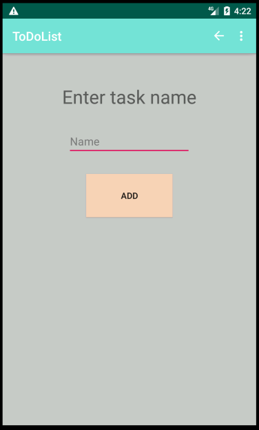

# ToDoList

Simple aplication for adding task that you dont want to forget.

## Things to fix(not working properly)

When adding subtask program adds each subtask as a new list. When deleted subtask gets deleted, it remembers it and you cannot delete next subtask because deleted one was remembered and saved somewhere. - FIXED!

# Screenshots of application

* Home screen

 

* Adding task screen

 

* Adding subtask screen

